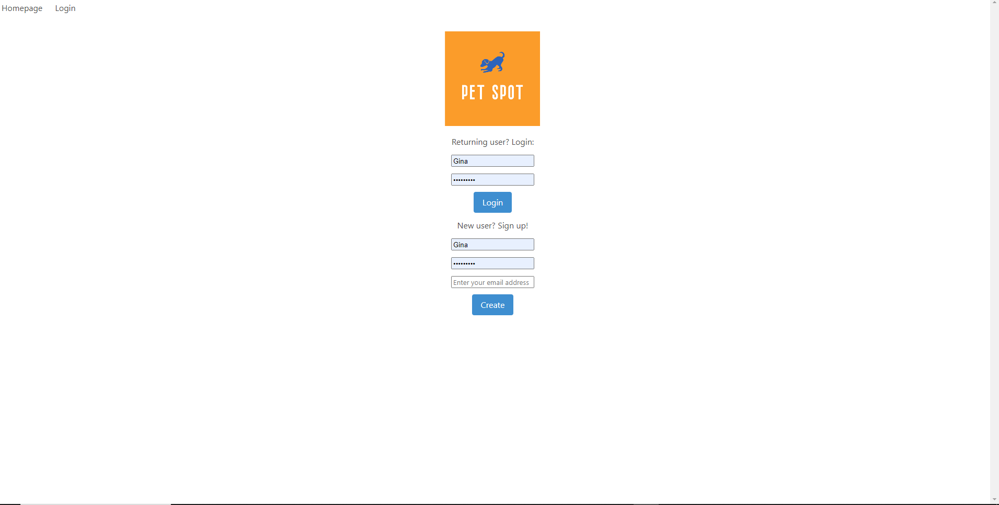
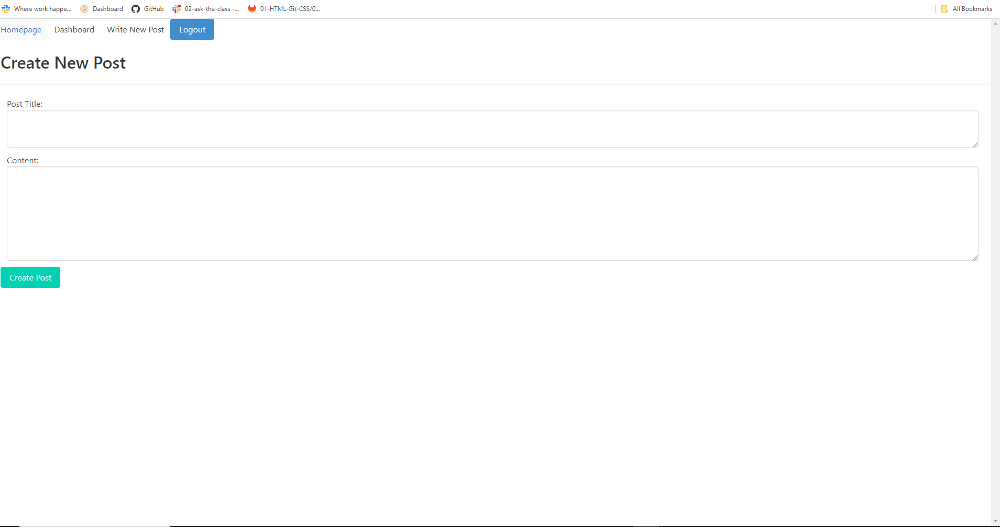

# PetSpot

## Description

Built this project to allow pets and other animals have a space to post their thoughts

## User Story

As a user, I want to visit the blog site
SO THAT I can publish blog posts

## Acceptance Criteria 

GIVEN  a blog site 
WHEN I visit the site for the first time 
THEN I am presented with a homepage that inclues exsiting blog posts; a Navbar with links to the homepage and login
WHEN I click on the homepage 
THEN I am taken to the homepage 
WHEN I click on the login link 
THEN I have the option to login or signup
WHEN I choose to signup 
THEN I am prompted to create a username, password and enter an email
When I click on the create button 
THEN my user information is saved and I am logged into the site
WHEN I want to visit the site and have an account created 
THEN I choose Login
WHEN I click login
THEN I am prompted to enter my username and password 
WHEN I am signed in to the site 
THEN I see the navigation links for the homepage, the dashboard, the option to write a new post, and the option to logout
WHEN I click on the homepage option in the navigation 
THEN I am taken to the homepage and presented with existing blog posts from differnt users
WHEN I click on the dashboard option in the navigation 
THEN I am taken to the dashboard and presented with any posts I have already created and the option to write a new post 
WHEN I click on the write new post button 
THEN I am prompted to to enter both a title and contents for my post
WHEN I click on the button to create new post 
THEN the title and contents of my post are saved and I and taken back to the updated dashboard 
WHEN I click on the logout option in the navigation 
THEN I an signed out of the site 

## Installation

- added env. file to the root of the project 
DB_NAME="petspot_db"
DB_USER="root"
DB_PASSWORD=""

## Usage

A mysql database and built the blog using Model-View-Controller. Built using Express, Sequelize, handlebars and dotenv

## Credits 

https://github.com/priyaravi23/mvc-tech-blog

## Application Deployment 

https://petspot-083c39b70dd9.herokuapp.com/

## Acknowledgements

- Justin Ramos - [JR728](https://github.com/JR728)
- Kamilla montes - [Kamilamontes](https://github.com/kamilamontes)
- Isaiah Waddington - [Isaiahw01](https://github.com/Isaiahw01)
- Scott Clarke - [Scott-J-Clarke](https://github.com/Scott-J-Clarke)